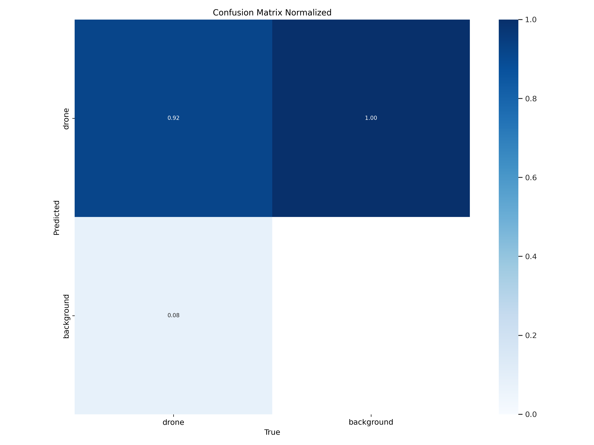
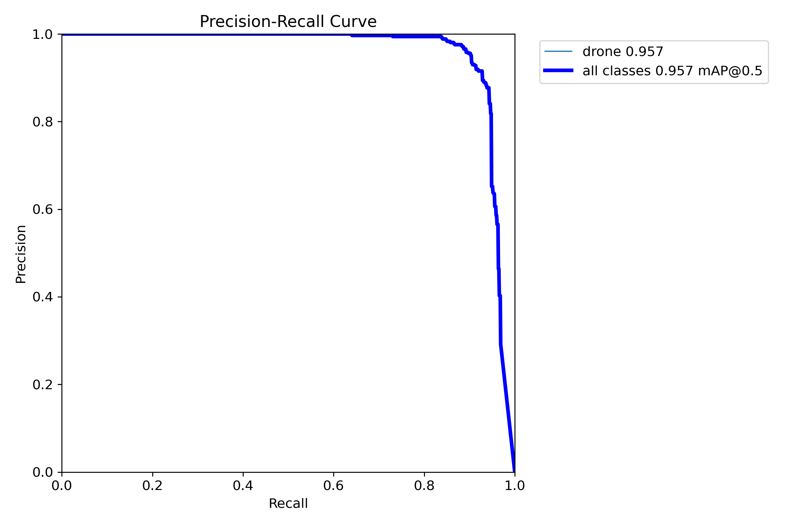
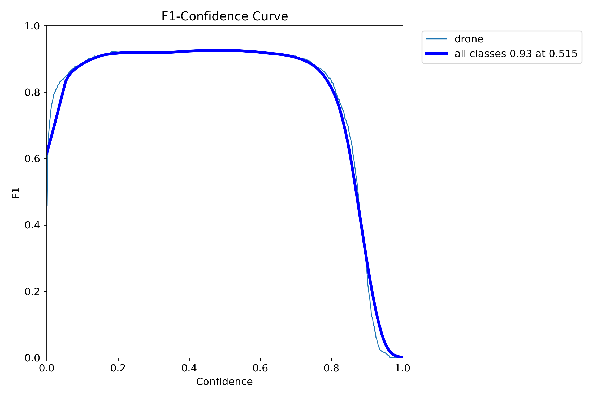
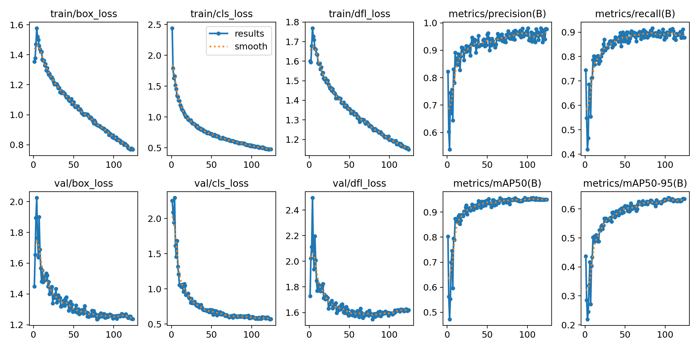

# Drone Detection using YOLO v11

This project focuses on detecting drones in images using the YOLO v11 object detection algorithm. The model was trained on a custom dataset and evaluated over 124 epochs, with the best performance achieved at epoch 97.

---

##  Model Performance

| Metric              | Value   |
|---------------------|---------|
| **Best Epoch**      | 97      |
| **Precision**       | 0.9575  |
| **Recall**          | 0.9118  |
| **mAP@0.5**         | 0.9572  |
| **mAP@0.5:0.95**    | 0.6278  |
| **Total Epochs**    | 124     |

---

## Results & Visualizations

### 1. Confusion Matrix (Normalized)


### 2. Precision-Recall Curve


### 3. F1-Score Curve


### 4. Training Results Summary


---

## How to Use

1. Clone the repository:
   ```bash
   git clone https://github.com/your-username/drone-detection-yolo-v11.git
   cd drone-detection-yolo-v11
   ```

2. Install requirements:
   ```bash
   pip install -r requirements.txt
   ```

3. Run inference:
   ```bash
   python detect.py --weights best.pt --img 640 --conf 0.25 --source data/images/
   ```

---

## Model Architecture

- **Backbone**: CSPDarkNet (YOLO v11)
- **Neck**: PANet
- **Head**: YOLO Head for bounding box regression and classification

---


## Training Details

- **Framework**: PyTorch
- **Input Size**: 640x640
- **Batch Size**: 16
- **Optimizer**: AdamW
- **Learning Rate**: 0.01 (with cosine decay)

  
# Drone Detection System Deployment on Raspberry Pi 3 B

This documentation explains how to deploy a YOLOv11n-based drone detection system on a Raspberry Pi 3 B running Debian Bullseye 64-bit. The setup includes SSH, VNC access, a virtual environment, required library installation, file transfers, camera setup, and real-time detection with alerting.

Hardware & Software Requirements:
- Raspberry Pi 3 B
- MicroSD card (8 GB or more)
- USB Webcam
- Laptop or Desktop (for setup and file transfers)
- Raspberry Pi OS: Debian Bullseye 64-bit (Lite or Full)
- Internet connection via 2.4GHz Wi-Fi

Step-by-Step Deployment Process:

1. Flash Raspberry Pi OS
- Use Raspberry Pi Imager to flash Debian Bullseye 64-bit onto the SD card.
- Enable SSH and Wi-Fi in advanced settings.
- Insert the SD card into the Raspberry Pi and power it on.

2. First-Time Setup
- Access Raspberry Pi using PuTTY.
- Enable VNC via `sudo raspi-config` > Interface Options > VNC > Enable.
- Use VNC Viewer on your laptop to view the Pi's GUI.

3. Update & Upgrade the System
```bash
sudo apt update && sudo apt upgrade -y
```

4. Create Project Directory and Virtual Environment
```bash
mkdir drone
cd drone
python3 -m venv venv
source venv/bin/activate
```

5. Install Required Libraries
```bash
pip install --upgrade pip
pip install ultralytics opencv-python pillow
```

6. Transfer Code and Model Files via SCP
```bash
scp -r path\to\your\project pi@<raspberry_pi_ip>:~/drone/
```

7. Connect and Configure USB Camera
```bash
sudo apt install fswebcam
fswebcam test.jpg
sudo apt install libopencv-dev python3-opencv
```

8. Real-Time Detection Script Execution
```bash
cd ~/drone
source venv/bin/activate
python detect_camera.py
```

Real-Time Alerting System:
- Use Telegram Bot API or Email (SMTP) to send alerts upon drone detection.
- Ensure your script handles webcam input and detection alerts.

Summary:
- Flash OS, enable SSH/VNC, setup Pi
- Install Python packages in a virtual environment
- Transfer code and run the detection script
- Use camera + detection + alerts


